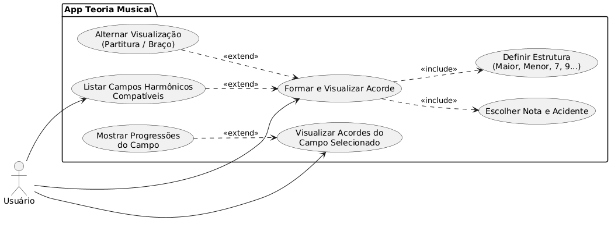

# Análise orientada a objeto
> [!NOTE]
> 
A <strong>análise</strong> orientada a objeto consiste na descrição do problema a ser tratado, duas primeiras etapas da tabela abaixo, a definição de casos de uso e a definição do domínio do problema.

## Descrição Geral do domínio do problema

O aplicativo tem como objetivo facilitar o entendimento de teoria musical, mostrando como os acordes são formados a partir de uma nota; Seus campos harmonicos; Progressões possíveis de acordes; Modulações; Inversões de acordes; Transposição e até mesmo rearmonização de uma tonalidade de uma sequência de acordes.

## Diagrama de Casos de Uso

Apresentar o diagram de casos de uso, identificando as funcionalidades do sistema assim como os atores envolvidos

    

Detalhamento dos casos de uso:
1. O Usuário seleciona uma nota musical (Dó, Ré, Mi...).

2. O Usuário seleciona um acidente (sustenido, bemol) ou deixa como natural.

3. O Usuário define a estrutura do acorde escolhendo a qualidade (maior, menor, aug, dim) e as extensões (7, 9).

4. O Sistema processa as informações e exibe a formação do acorde na tela.

5. O Sistema exibe a representação do acorde em formato de Partitura (visualização padrão).

6. O Sistema calcula e exibe uma lista de Campos Harmônicos (principais maiores e menores) dos quais esse acorde faz parte.

7. O Usuário clica em um dos campos harmônicos da lista.

8. O Sistema exibe todos os acordes pertencentes ao campo harmônico selecionado.

9. O Sistema exibe as progressões de acordes mais comuns associadas a esse campo harmônico específico.
- [UC1: Jogar](uc01.md)

 
## Diagrama de Domínio do problema

Elaborar um diagrama conceitual do domínio do problema.

[Retroceder](README.md) | [Avançar](projeto.md)

